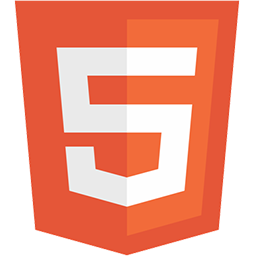
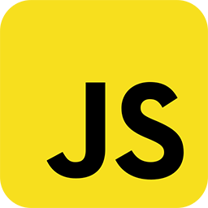
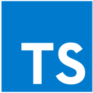
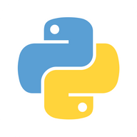

# Hi, I'm Fábio Corrêa 👋

### About me

- 🧔🏽 I'm 25 years old, brazilian living in Belo Horizonte
- 🌱 I’m currently taking a Full Stack Development course at [Trybe](https://www.betrybe.com/)
- 👯 I’m looking for job opportunities as a software developer
- ⚡ Currently also taking 2 intensive courses on Computer Science:

1. [Harvard's CS50](https://cs50.harvard.edu/x/2020/)
2. [Rocketseat's Go Stack](https://rocketseat.com.br/)

### Languages and Tools

 

### Contact Me!

 
